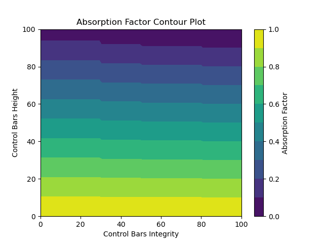
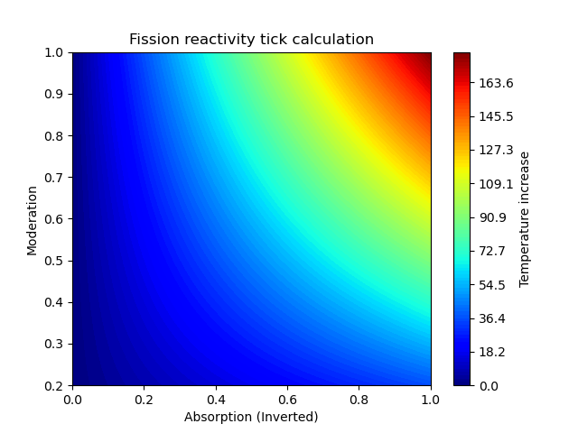

# Nuceleares graphs
This repo has python to create graphs to make Nucleares (game) parameters more clear.

## Fuel level safe extraction conditions

This graph shows the damage incurred to fuel and core based on the core external vessel level at time of fuel extraction, and the fuel temperature. Below 10% vessel level the damage is futher reduced and limited to only the fuel (not shown on chart).

## Power of Moderation

This graph shows the power of moderation calculation for the reactor based on the level of steam and water within the reactor core.

## Absorption Factor

This graph shows the Absorption Factor calculation, which is inverted (High absorption = 0.0, low absorption = 1.0) from what you'd expect from control rod insertion.

## Reactivitiy

This graph shows the fission reactivity per tick, based on the moderation and absorption factor, showing the increase in temperature (based on fresh fuel).

